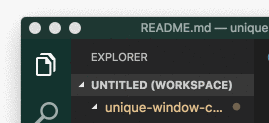

# VSCode Project Dashboard

**VSCode Project Dashboard** is a Visual Studio Code extension that lets you organize your projects in a speed-dial like manner. Pin your frequently visited **folders**, **files**, and **SSH remotes** onto a dashboard to access them quickly.

## Workspace colors

This version support retrieving colors from vscode settings of project. All you need to enable this feature is select the `Workspace Color` option in color selector when adding a tab to project dashboard.

Also this extension automagically setting up workspace colors, when you open a project (Forked from [Window Colors](https://marketplace.visualstudio.com/items?itemName=stuart.unique-window-colors))

**Improtant:** if settings file is not changed, colors will be removed when you close the workspace.

## Usage

The dashboard is a dedicated UI that can be opened using a command or **_ctrl + F1_** and configured to open automatically. Clicking a project opens it in the current window, while **_ctrl + click_** (**_cmd + click_** on Mac) opens it in a new window.

Projects are separated into groups and can be assigned a color to find them quickly. Managing the groups and projects is done **directly on the dashboard**.

## Good to know

- You can **edit** and **reorder** projects and groups directly on the dashboard.
- **Emojis** may (or may not, depending on your preference) be good icons for projects. You can add them by pressing WIN + . (under Windows) while naming the project.
- You can use **gradients** as project color, via CSS Gradient functions like linear-gradient and radial-gradient.
- Only **colors** defined by the theme were used. So the dashboard should always blend nicely into your VSCode design. If not, you can customize them in the settings.
- The extension automatically detects if a project is a **Git repository**. If so, this is indicated by an icon.
- The filter option can be toggled by **ctrl + f** or disabled via settings.

## Configuration

The dashboard can be configured and customized using the VSCode configuration:

- Projects are stored in the globalState by default (saved on the machine) but can be set to be saved in the settings (to be synced via [Settings Sync](https://marketplace.visualstudio.com/items?itemName=Shan.code-settings-sync)) instead. Note that by doing so, you remove the possibility of having different dashboards on your synced devices.
- Startup behavior (open always, on empty editor, or never)
- Placement of '+' buttons
- Visibility of project path
- Project tile size
- Filter option's default visibility
- Colors (see below)

By default, the dashboard uses only colors defined by the theme, which was tested against all default themes. If you use a custom theme and see the dashboard's colors unfit, you can change them in the settings (Settings > Dashboard). Following settings can be changed to any CSS color (name, hex, rgba, hsl, var) or left empty (for default):

- Project Card Background
- Project Name Color
- Project Path Color

## Changelog

[View Changelog](CHANGELOG.md)

## Acknowledgements

- Special thanks to [Font Awesome](http://fontawesome.io) [(License)](https://fontawesome.com/license) for the icons used in the dashboard.
- The color names are generated using the [Name that Color](http://chir.ag/projects/name-that-color/#6195ED) library.
